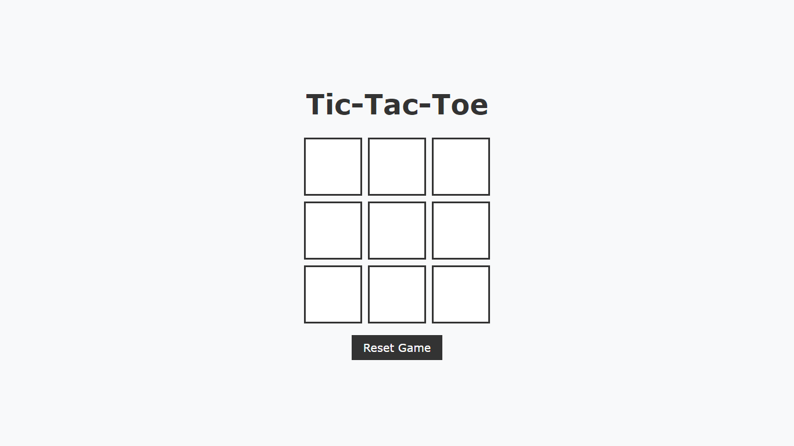
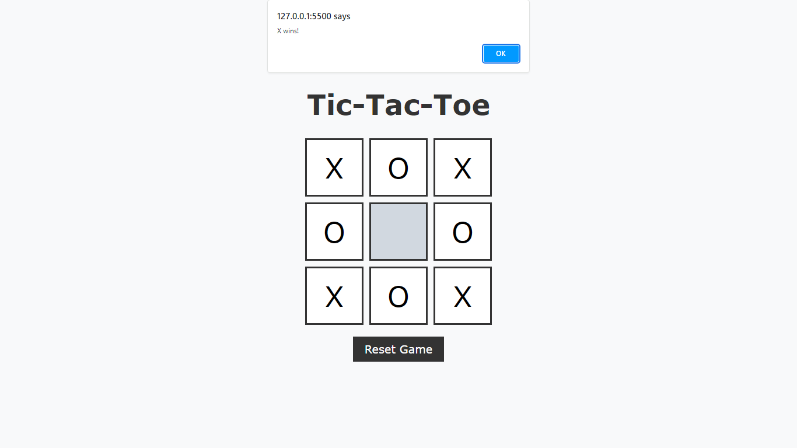
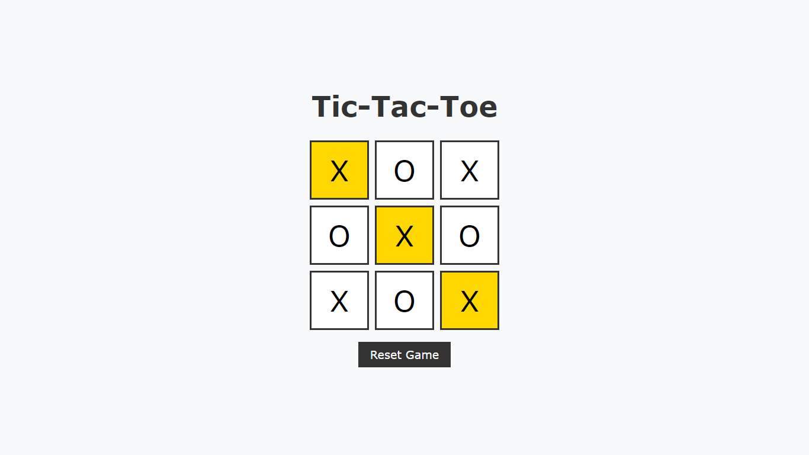
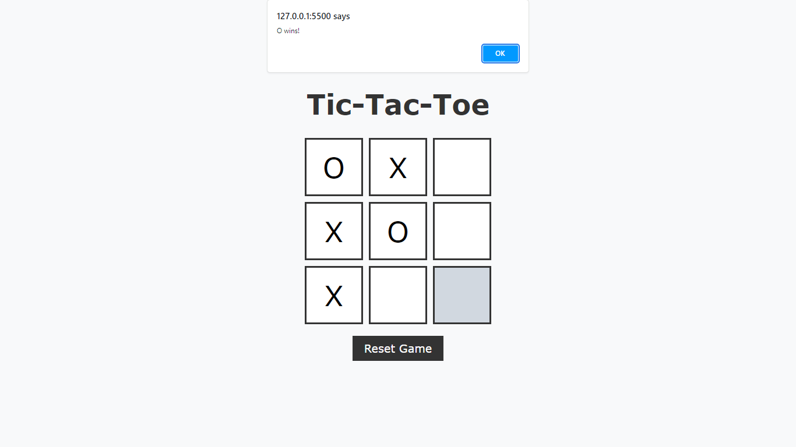
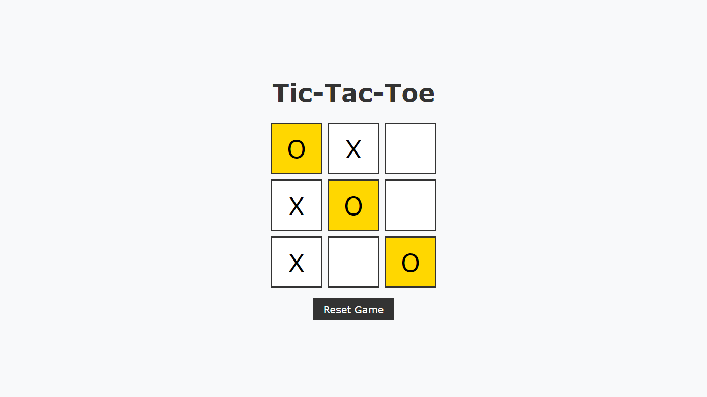
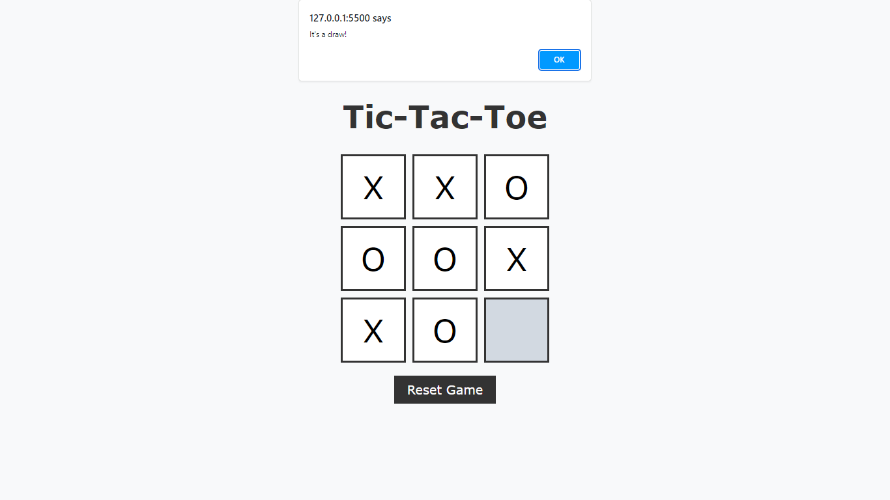
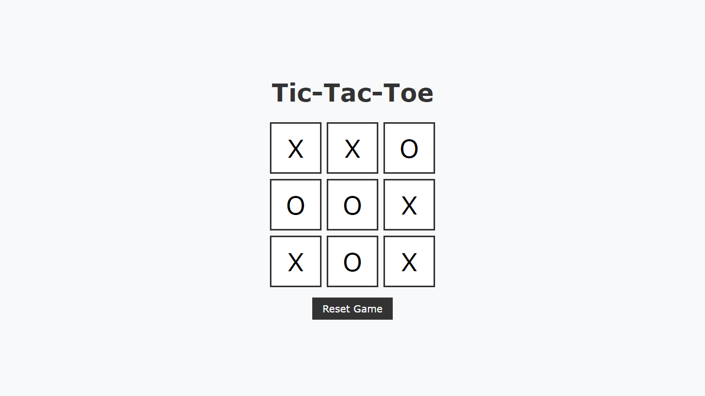

# Tic-Tac-Toe Web Application

Welcome to the Tic-Tac-Toe web application, a fun and interactive game built using HTML, CSS, and JavaScript. 

## Table of Contents

- [Introduction](#introduction)
- [Features](#features)
- [Project_Images](#project_images)
- [Installation](#installation)
- [Usage](#usage)
- [Contributing](#contributing)
- [Author](#author)

## Introduction

This project contains the source code for a Tic-Tac-Toe web application. It offers an engaging gaming experience with a simple interface and intuitive gameplay.

## Features

- **Responsive Design:** The game is designed to adapt to various screen sizes and devices, ensuring a seamless experience across desktop and mobile platforms.
- **Player vs. Player:** Challenge a friend and compete in exciting matches to determine the ultimate Tic-Tac-Toe champion.
- **Interactive Gameplay:** Click on the grid to place your marker ('X' or 'O') and strategize your moves to outsmart your opponent.
- **Winning Detection:** The game automatically detects winning combinations and declares the winner when a player achieves three markers in a row.
- **Draw Detection:** If all cells are filled without a winner, the game recognizes a draw and ends the match.
- **Reset Functionality:** Easily reset the game at any time to start a new match and continue the fun.

## Screenshots

## Installation

To play the game locally, follow these simple steps:

1. Clone this repository to your local machine.
2. Navigate to the `PRODIGY_WD_03` folder.
3. Open `index.html` file in your web browser.
4. Start playing Tic-Tac-Toe!

## Usage

Click on the cells of the grid to place your markers. Strive to create a sequence of three markers in a row, either horizontally, vertically, or diagonally, to win the game. If all cells are filled without a winner, the game ends in a draw. Use the reset button to start a new game at any time.

## Contributing

Contributions to this project are highly appreciated! To contribute, follow these steps:

- Fork the repository and create your branch.
- Make your enhancements or bug fixes.
- Test your changes thoroughly.
- Commit your changes and push to your fork.
- Create a pull request with a clear description of your contributions.

## Author

Himanshu Maurya.

Enjoy playing Tic-Tac-Toe and may the best strategist win!
